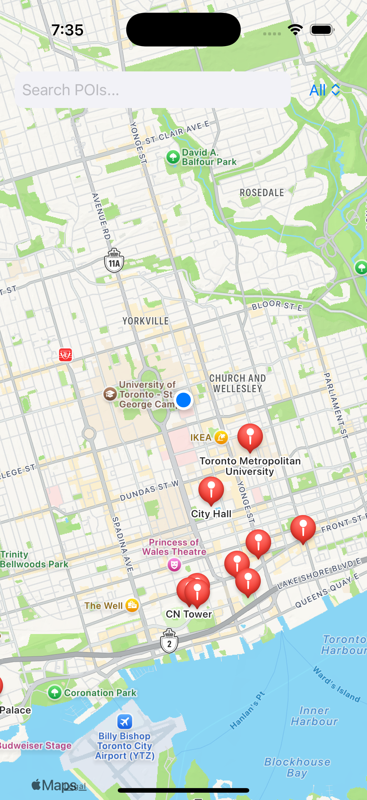
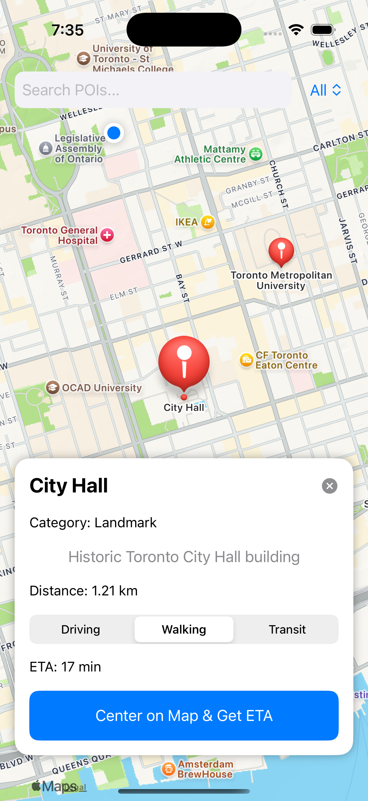
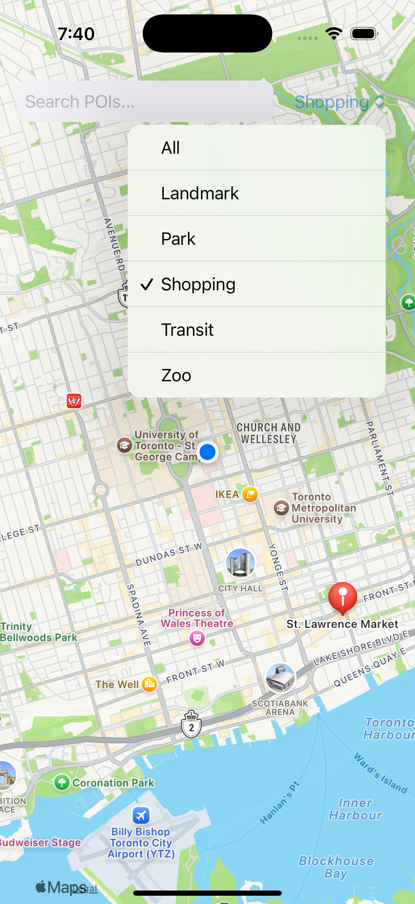
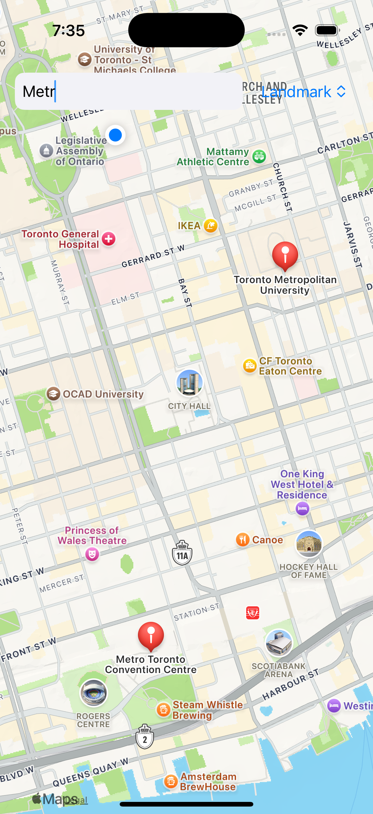

# 🗺️ Location-Based iOS App

This project is an iOS SwiftUI app that displays user location and Points of Interest (POIs) on a map.
The app also supports search, filtering, ETA calculation, and distance display.

---

## 📦 Installation Instructions

1. Open `LocationApp.xcodeproj` in Xcode 15 or later.
2. Run it on an iOS 17+ simulator or real device.
3. Make sure location permission is enabled when the app asks.
4. No need to install any libraries — everything is native.

---

## ✨ Features Overview

### 📍 User Location

- Uses `CoreLocation` to track user’s position
- Map updates and centers on user location

### 📌 Points of Interest (POIs)

- POIs include CN Tower, City Hall, Union Station, TMU, Exhibition Palace, etc.
- Each POI has:
  - Name
  - Description
  - Category
  - Location (Lat/Lng)

### 🔍 Search & Filter

- You can search POIs by name
- Filter POIs by category (Landmark, Park, Zoo, etc.)

### 🧭 Navigation + Distance

- See real-time distance from user to POI
- Choose travel mode (Driving, Walking, Transit)
- See estimated time of arrival (ETA)
- Powered by `MKDirections`

---

## 📁 File Structure

```
LocationApp/
├── ContentView.swift           # Main UI and Map logic
├── LocationManager.swift       # Handles CoreLocation permissions + updates
├── POI.swift                   # POI struct with id, name, location, category
├── POIDetailView.swift         # Optional detail view (if used in modal)
├── LocationAppApp.swift # App entry point
├── Assets.xcassets             # App icons + colors
├── Info.plist                  # Permissions setup
```

---

## 📸 Screenshots

In the `screenshots/` folder (not attached here):

- `map-view.png` – map with user location and POIs
- `detail-view.png` – info for selected POI
- `filter-search.png` – search bar and filter dropdown

**map with user location and POIs**  


**info for selected POI**  


**search bar and filter dropdown**  


**Search Locations on Text Field**  


---

## 🧰 Technologies Used

- SwiftUI
- MapKit
- CoreLocation
- MKDirections

---

## ⚠️ Known Issues / Limitations

- Route lines are not drawn (just ETA is shown)
- POIs are hardcoded in the app — not loaded from external source
- Only works fully with location permission granted
- No offline mode or persistence

---

Thanks for reading — this app was fun to build and shows real use of iOS location APIs!
